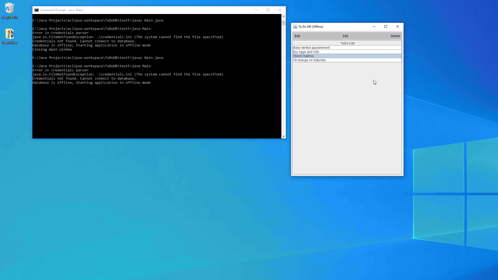

# ToDo DB  
Simple ToDo list application built with Java and MySQL. Uses Java's swing library for the GUI.   
This project was made in order to learn more about making GUIs and using MySQL.  
The following instructions are made for a Windows machine. I do not have a Mac to test this program  
on so I apologize in advance for any compatibility issues.   

## What you need  
In order to use this program you will need to have Java installed. Java 8 is the recommended version  
if you are going to take advantage of the database portion of this project.  
Otherwise, Java 7 should work fine for testing the project in demo mode. You do not need a Java IDE.  

## <a name="start"></a> Quick Start / Demo Mode
Running the application in demo mode is the easiest way to test this project. 
### From the command line
For the steps below, if you do not [have Java in your system variables PATH](https://docs.oracle.com/javase/tutorial/essential/environment/paths.html), 
you should substitute  
`javac` and `java` for the path to your Java installation. For example:  
`C:\Java\jdk1.8.0\bin\javac` and `C:\Java\jdk1.8.0\bin\java` respectively.  
1. Navigate to the `src` folder once you have downloaded the project.
2. Run the following command: `javac Main.java`
3. Now run the following: `java Main`
4. The project will not find the database credentials and start in offline/demo mode.  
5. Done.  

### From an IDE
1. Import the project into your Java IDE of choice.
2. Run the `Main.java` file and the IDE should build and run the project.  
3. Done.  

## Online Mode
In order to take advantage of the database portion of this project, you must have a MySQL server you  
can connect to and the [MySQL Connector for Java](https://dev.mysql.com/downloads/connector/j/).
There are various [tutorials on this topic](https://youtu.be/u96rVINbAUI) if you are  
not sure where to start. Once you have your SQL server online, you must create a new schema called "todo".  
In the "todo" schema, create a new table using these SQL instructions:  
```sql
  CREATE TABLE `entries` (
      `entry_id` INT NOT NULL AUTO_INCREMENT,
      `entry_body` VARCHAR(255) DEFAULT NULL,
      `entry_user` VARCHAR(16) DEFAULT NULL,
      `entry_time` TIMESTAMP NULL DEFAULT CURRENT_TIMESTAMP,
      PRIMARY KEY (`entry_id`)
  );
```  

 You will also need to modify the `credentials-template.ini` file found in the repository.  
 - For the 'URL', you will need to change the "examplehost:1111/todo" to your actual host and port number.  
 - For 'DB_USER', change "ExampleUser" to the username for your SQL server.  
 - For 'DB\_USER\_PW', change the "ExamplePassword" to your password for your corresponding SQL server username.  
   You can easily [create a SQL server](https://youtu.be/u96rVINbAUI) with a dummy password and username on your local machine.  

Now you can run steps 1 and 2 from the [Quick Start](#start) guide. However, we must include the  
path to the installation of the MySQL Connector for Java.  
```
cd src
javac Main.java
java -cp .;"C:\MySQL\Connector J 8.0\mysql-connector-java-8.0.jar" Main
```  
If your server is online the application should now be running in online mode.  

## Small Demo  
  
